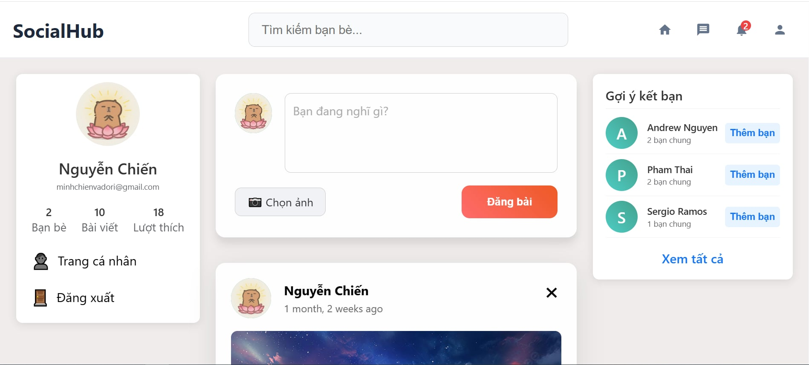
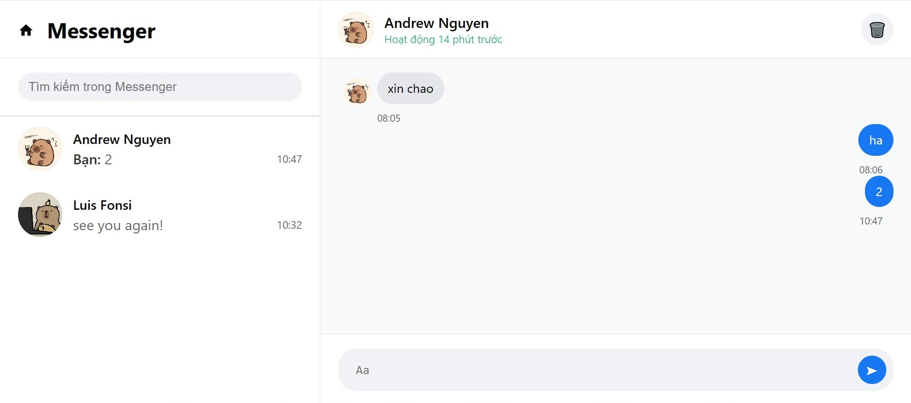
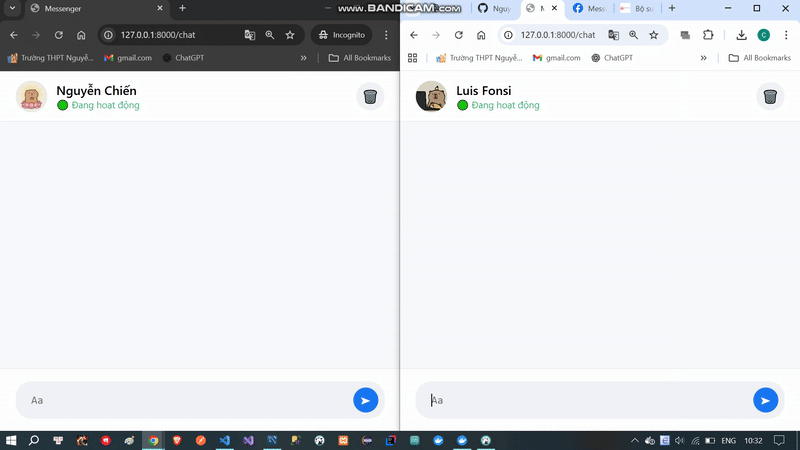
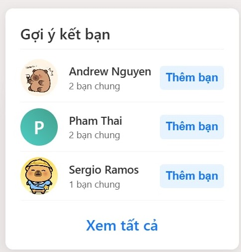

# 🌐 Social Network Website Project  

## 🔍 System Overview  

This project is a **social networking platform** built with **Django (Python backend)**.  
It simulates a modern social media app where users can connect, share posts, comment, and chat.  
The focus is on **user interaction, real-time communication**.  

---

## 🌟 Key Features  

- 🔐 **User Authentication** (Sign up, Login, Password Reset, Google OAuth optional)  
- 👤 **User Profile Management** (avatar, bio, personal info)  
- 📝 **Post Creation & Sharing** (text, images)  
- 💬 **Comment & Reply System** (nested comments supported)  
- 👍 **Like/Reaction System** on posts & comments  
- 👥 **Friendship Management** (send/accept friend requests, unfriend)  
- 🔔 **Notification System** (new likes, comments, friend requests)  
- 💌 **Direct Messaging** between users  
- 🔎 **Search Functionality** (users, posts)  

---

## 👤 User Role  

- 📝 Create, edit, and delete own posts  
- 💬 Comment and reply on posts  
- 👍 Like/unlike posts and comments  
- 👥 Add/remove friends, manage friend requests  
- 💌 Send private messages to friends  
- ✏️ Update personal profile  

---

## 🖼️ UI/UX Screenshots  

### 🏠 Home Feed
<small>The main feed displaying posts from friends and followed users.</small> 

### 💌 Messaging System
<small>Direct messaging interface for private conversations between users</small> 

### 📹 VIDEO REALTIME CHATTING

### 👥 Suggest Friends
<small>A list of suggested friends based on mutual connections and interests.</small> 

---

## 🚀 Technologies Used  

- **Backend:** Django, Django REST Framework  
- **Frontend:** HTML, CSS, JavaScript (Bootstrap)  
- **Database:** MySQL  
- **Authentication:** Django Auth, OAuth (Google/Facebook optional)  
- **Tools:** Git, Postman (API testing), Figma (UI design)  

---
